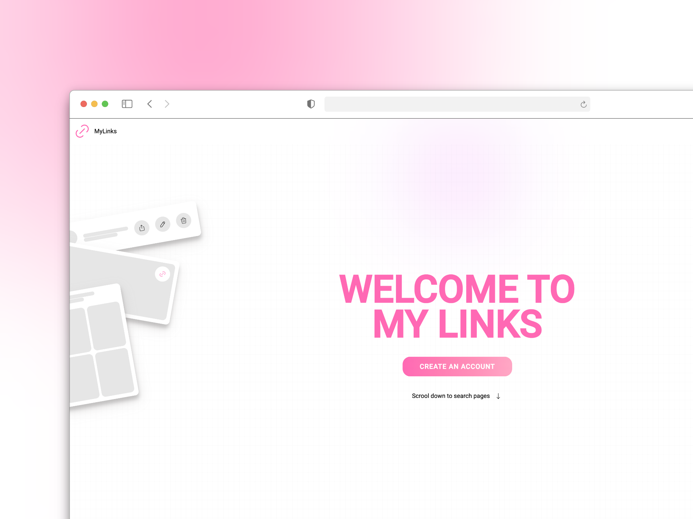

# Proyecto: API para Red Social de Enlaces Personales - Backend

Este proyecto es la API backend de una aplicación web donde cada usuario puede crear y personalizar su propia página, añadiendo enlaces a sus redes sociales, sitios web personales o cualquier otro enlace que desee compartir. El backend gestiona la autenticación, la base de datos y la lógica de negocio de la aplicación.

## Características

- **Autenticación de usuarios**: Gestión segura de registros e inicio de sesión.
- **CRUD de enlaces**: Los usuarios pueden crear, leer, actualizar y eliminar sus enlaces.
- **Gestión de perfiles**: API para la gestión de los perfiles de usuario y sus configuraciones.
- **Base de datos segura**: Almacenamiento de datos de manera eficiente y segura.

## Tecnologías utilizadas

- **Node.js**: Plataforma de ejecución para el servidor.
- **Express**: Framework para la creación de la API RESTful.
- **JWT**: Para la autenticación y gestión de sesiones.
- **SQLite con Turso**: Base de datos ligera y eficiente para el almacenamiento de datos.

## Estado del proyecto
Este proyecto está actualmente en desarrollo. Se están implementando nuevas características y corrigiendo errores.

## Notas
Existen aplicaciones similares ya en el mercado, como Linktree, que ofrecen funcionalidades parecidas. Este proyecto es un ejercicio educativo y no tiene fines comerciales.

## Instalación

1. Clona el repositorio:
   ```bash
   git clone https://github.com/pabloconejos/mylinks_back.git
2. Navega al directorio del proyecto:
    ```bash
    cd mylinks_back
3. Instala las dependencias:
    ```bash
    npm install
4. Configura las variables de entorno en config.js:
    ```bash
    export const {
      _PORT = 3000,
      _SALT_ROUNDS = 10,
      _SECRET_JWT_KEY = '', // JWT KEY
      _AUTHTOKEN = '', // TURSO AUTHTOKEM
      _URI = '' // DATABASE URI
    } = process.env
    
5. Ejecuta el servidor en modo de desarrollo:
   ```bash
   npm run dev
